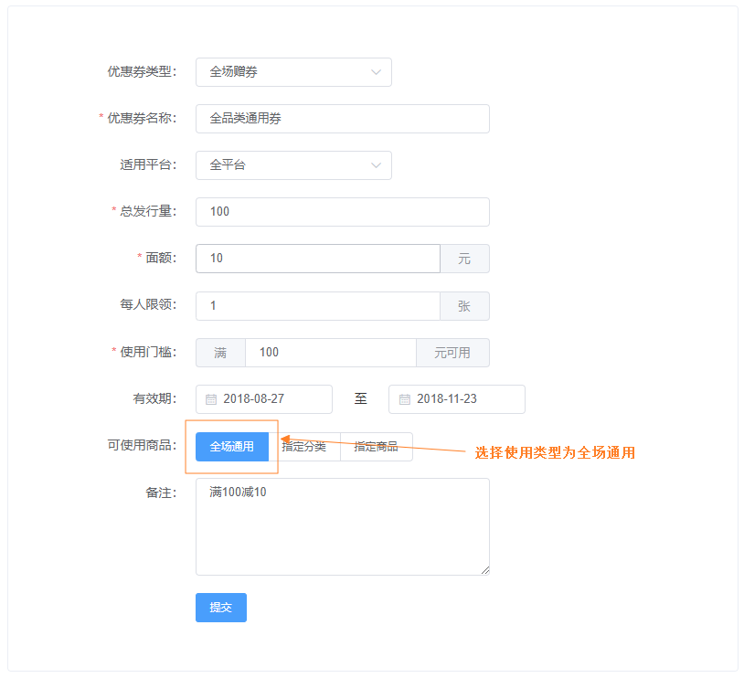
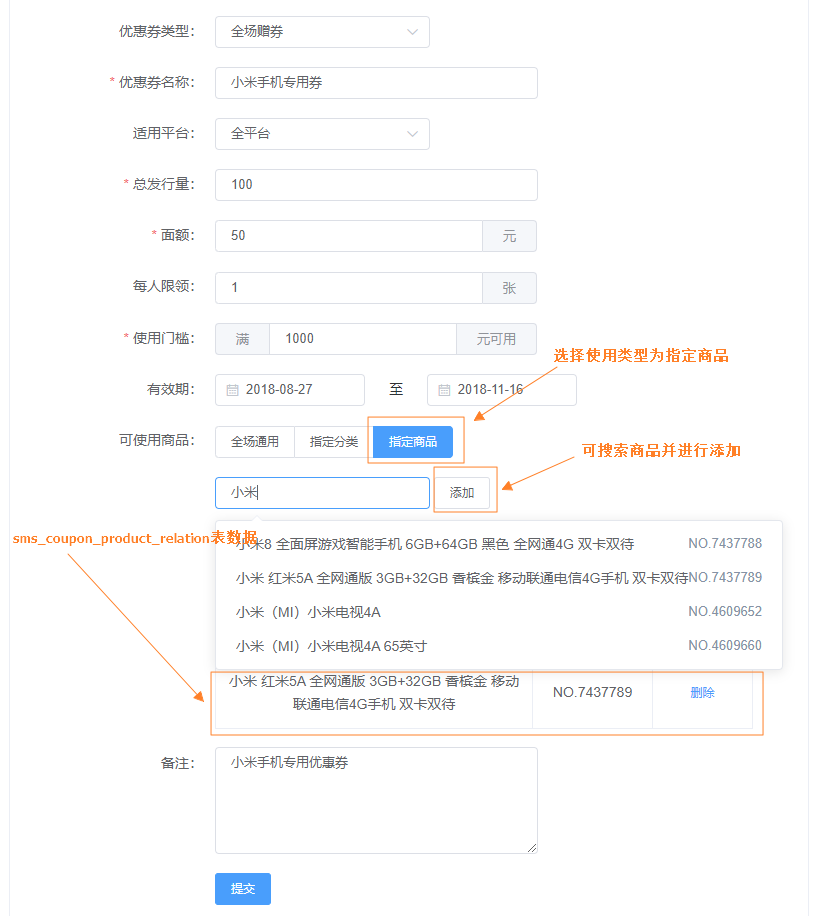
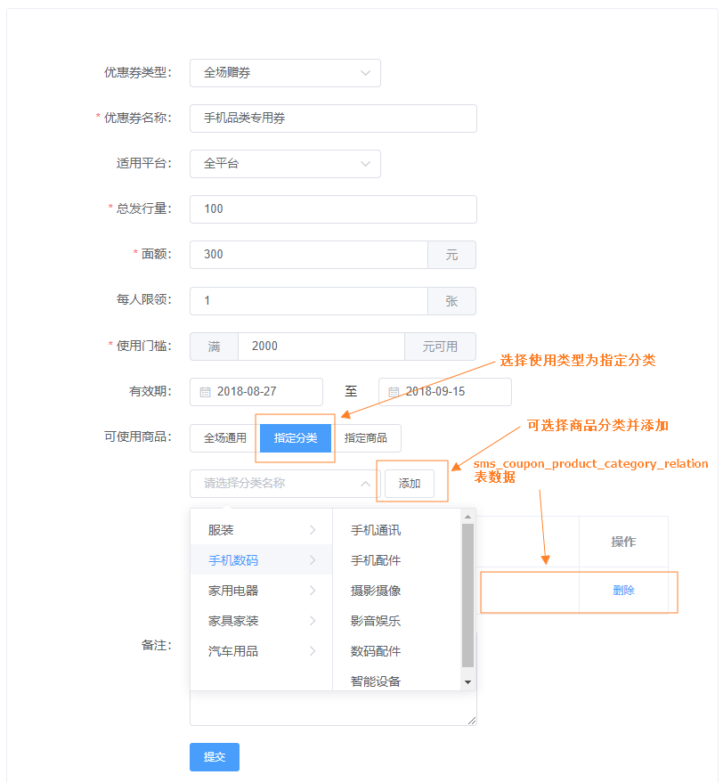
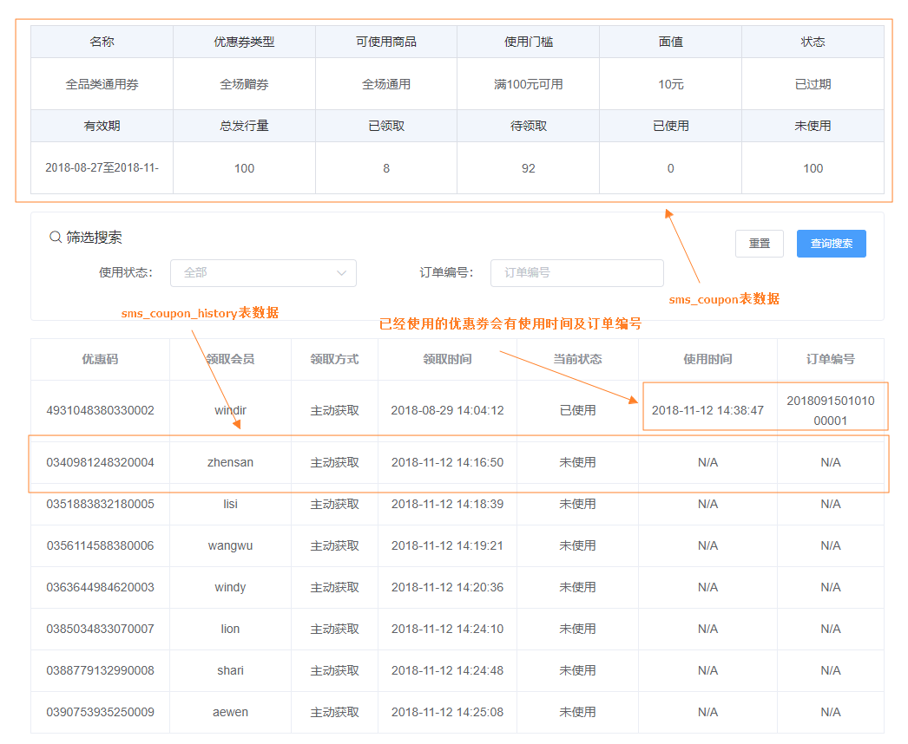
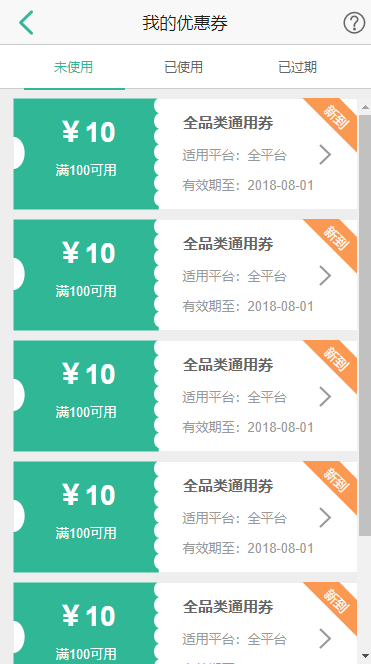
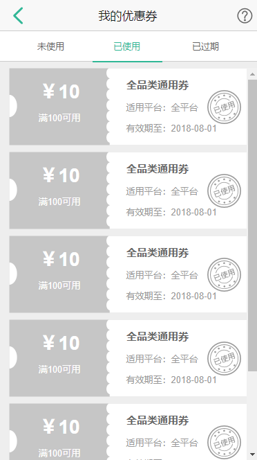
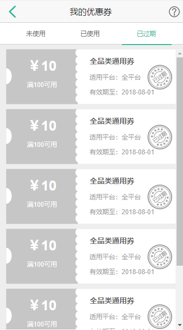
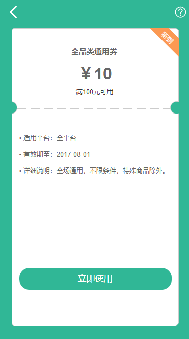

mall项目全套学习教程连载中，[关注公众号](#公众号)第一时间获取。

# 营销模块数据库表解析：优惠券功能

> 本文主要对优惠券功能相关表进行解析，采用数据库表与功能对照的形式。

## 相关表结构

### 优惠券表

> 用于存储优惠券信息，需要注意的是优惠券的使用类型：0->全场通用；1->指定分类；2->指定商品，不同使用类型的优惠券使用范围不一样。

```sql
create table sms_coupon
(
   id                   bigint not null auto_increment,
   type                 int(1) comment '优惠卷类型；0->全场赠券；1->会员赠券；2->购物赠券；3->注册赠券',
   name                 varchar(100) comment '名称',
   platform             int(1) comment '使用平台：0->全部；1->移动；2->PC',
   count                int comment '数量',
   amount               decimal(10,2) comment '金额',
   per_limit            int comment '每人限领张数',
   min_point            decimal(10,2) comment '使用门槛；0表示无门槛',
   start_time           datetime comment '开始使用时间',
   end_time             datetime comment '结束使用时间',
   use_type             int(1) comment '使用类型：0->全场通用；1->指定分类；2->指定商品',
   note                 varchar(200) comment '备注',
   publish_count        int comment '发行数量',
   use_count            int comment '已使用数量',
   receive_count        int comment '领取数量',
   enable_time          datetime comment '可以领取的日期',
   code                 varchar(64) comment '优惠码',
   member_level         int(1) comment '可领取的会员类型：0->无限制',
   primary key (id)
);
```

### 优惠券历史记录表

> 用于存储会员领取及使用优惠券的记录，当会员领取到优惠券时，会产生一条优惠券的记录，需要注意的是它的使用状态：0->未使用；1->已使用；2->已过期。

```sql
create table sms_coupon_history
(
   id                   bigint not null auto_increment,
   coupon_id            bigint comment '优惠券id',
   member_id            bigint comment '会员id',
   order_id             bigint comment '订单id',
   coupon_code          varchar(64) comment '优惠券码',
   member_nickname      varchar(64) comment '领取人昵称',
   get_type             int(1) comment '获取类型：0->后台赠送；1->主动获取',
   create_time          datetime comment '创建时间',
   use_status           int(1) comment '使用状态：0->未使用；1->已使用；2->已过期',
   use_time             datetime comment '使用时间',
   order_sn             varchar(100) comment '订单号码',
   primary key (id)
);
```

### 优惠券和商品的关系表

> 用于存储优惠券与商品的关系，当优惠券的使用类型为指定商品时，优惠券与商品需要建立关系。

```sql
create table sms_coupon_product_relation
(
   id                   bigint not null auto_increment,
   coupon_id            bigint comment '优惠券id',
   product_id           bigint comment '商品id',
   product_name         varchar(500) comment '商品名称',
   product_sn           varchar(200) comment '商品条码',
   primary key (id)
);
```

### 优惠券和商品分类关系表

> 用于存储优惠券与商品分类的关系，当优惠券的使用类型为指定分类时，优惠券与商品分类需要建立关系。

```sql
create table sms_coupon_product_category_relation
(
   id                   bigint not null auto_increment,
   coupon_id            bigint comment '优惠券id',
   product_category_id  bigint comment '商品分类id',
   product_category_name varchar(200) comment '商品分类名称',
   parent_category_name varchar(200) comment '父分类名称',
   primary key (id)
);
```

## 管理端展现

### 优惠券列表


### 编辑优惠券

#### 全场通用


#### 指定商品


#### 指定分类


### 查看优惠券


## 移动端展现

### 我的优惠券

#### 未使用


#### 已使用


#### 已过期


### 优惠券详情


## 公众号


